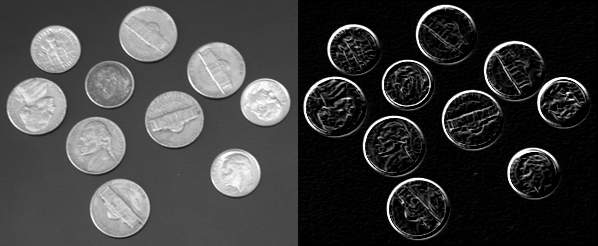

# Criação de Threads

- Aluno: Raphael Ramos da Silva
- Matricula: 20200081884

## Descrição da biblioteca de threads utilizada

A linguagem C foi utilizada para o desenvolvimento do trabalho. Utilizou-se funções da biblioteca pthread para direcionar a lógica do programa multithread responsável por fazer a segmentação da imagem de interesse. Essas funções foram: `pthread_create` (responsável pela instanciação das threads) e `pthread_join` (responsável pela sincronização das threads). Além disso, a diretiva `pthread_t` foi utilizada para declarar as threads.

## Explicação do programa

O programa desenvolvido neste projeto está modularizado em funções. Então, abaixo está a apresentação da função principal com as chamadas das funções desenvolvidas.

```c
// Bibliotecas utilizadas
#include <pthread.h>
#include <stdio.h>
#include <stdlib.h>

// # de threads
#define N 2 

int main() {
    int** pixels;       // Matriz de pixels da imagem
    int** g;            // Matriz resultado do processamento
    int width, height;  // Largura e altura
    int max_value;      // Valor maximo dos pixels

    // Ler imagem
    pixels = read_image("coins.ascii.pgm", &width, &height, &max_value);

    // Processar imagem com threads
    g = process_image(pixels, height, width);

    // Exportar imagem
    export_image("coins-processed.ascii.pgm", g, width, height, max_value);

    // Liberar memoria ocupada pelas matrizes
    for (int i = 0; i < height; i++) {
        free(pixels[i]);
        free(g[i]);
    }
    free(pixels);
    free(g);

    return 0;
}
```

A matriz de interesse e a matriz com os seus contornos segmentados são alocadas dinamicamente nos ponteiros `pixels` e `g`, respectivamente. A função `read_image` é responsável por fazer a leitura da imagem de interesse, em PGM, e criar uma matriz com todos os seus pixels, além de armazenar nas variáveis `width` e `height` a largura e altura da imagem. A seguir está sua implementação

```c
/**
 * Faz a leitura do arquivo pgm
 * @param path          caminho para onde a imagem está
 * @param width         largura da imagem
 * @param height        altura da imagem
 * @param max_value     valor maximo da matriz
 */
int** read_image(char* path, int* width, int* height, int* max_value) {
    FILE* file;
    char magic[3];
    int** pixels;

    // Abra o arquivo PGM para leitura
    file = fopen(path, "r");

    // Leia o cabeçalho PGM
    fscanf(file, "%s", magic);

    // Leia a largura, altura e valor máximo
    fscanf(file, "%d %d", width, height);
    fscanf(file, "%d", max_value);

    // Aloque memória para a matriz 2D de pixels
    pixels = (int**)malloc((*height) * sizeof(int*));
    for (int i = 0; i < *height; i++) {
        pixels[i] = (int*)malloc((*width) * sizeof(int));
    }

    // Leia os valores de pixel e preencha a matriz 2D
    for (int i = 0; i < *height; i++) {
        for (int j = 0; j < *width; j++) {
            fscanf(file, "%d", &pixels[i][j]);
        }
    }

    // Fechar o arquivo
    fclose(file);

    // Retorna matriz com os pixels da imagem
    return pixels;
} 
```

O próximo passo foi fazer a segmentação da imagem de interesse com a função `process_image`, a qual utiliza uma rotina multithread para realizar essa tarefa e retornar um ponteiro para a matriz processada, o qual é alocado na variável `g`. A seguir está sua implementação

```c
/**
 * Identifica contorno na imagem
 * @param m altura
 * @param n largura
 */
int** process_image(int** img, int m, int n) {
    // Vetor de threads
    pthread_t tid[N];

    // Matriz de contornos
    int** g = (int**)malloc((m) * sizeof(int*));

    // Matrizes com as mascaras de deteccao de bordas
    int** gx = (int**)malloc((m) * sizeof(int*));
    int** gy = (int**)malloc((m) * sizeof(int*));

    // Alocar matrizes
    for (int i = 0; i < m; i++) {
        g[i] = (int*)malloc((n) * sizeof(int));
        gx[i] = (int*)malloc((n) * sizeof(int));
        gy[i] = (int*)malloc((n) * sizeof(int));
    }

    // Montar parametros para as threads
    TParams* params = (TParams*)malloc(sizeof(TParams));
    params->img = img;
    params->gx = gx;
    params->gy = gy;
    params->m = m;
    params->n = n;

    // Calcular as informações de bordas em X
    pthread_create(&tid[0], NULL, generate_gx, (void*)params);

    // Calcular as informações de bordas em Y
    pthread_create(&tid[1], NULL, generate_gy, (void*)params);

    // Sincronizar threads
    for (int i = 0; i < N; i++) {
        pthread_join(tid[i], NULL);
    }

    // Gerar matriz com os contornos
    for (int i = 0; i < m - 1; i++) {
        for (int j = 0; j < n - 1; j++) {
            g[i][j] = gx[i][j] + gy[i][j];
            if (g[i][j] > 255) g[i][j] = 255;
        }
    }

    // Liberar memoria ocupada pelas matrizes
    for (int i = 0; i < m; i++) {
        free(gx[i]);
        free(gy[i]);
    }
    free(gx);
    free(gy);

    // Liberar memoria ocupada pelo struct de parametros das threads
    free(params);

    // Retorna matriz de contornos
    return g;
}
```

Como se pode observar, duas threads foram criadas com chamadas de `pthread_create` pela thread mãe para fazer a identificação das bordas: a thread filha `generate_gx` detecta as bordas em X, e a `generate_gy` detecta as bordas em Y. Ambas recebem como parâmetro um ponteiro para struct que aponta para a estrutura `TParams`, a qual possui as propriedades necessárias para as threads filhas fazerem as suas tarefas. 

Abaixo estão as definições desse struct e das threads filhas

```c
/**
 * Struct de parametros enviados para a thread
 * @param m     numero de linhas da matriz (altura)
 * @param n     numero de colunas da matriz (largura)
 * @param img   matriz a ser processada
 * @param gx    mascara para identificar borda em X
 * @param gy    mascara para identificar borda em Y
 */
typedef struct {
    int m;
    int n;
    int** img;
    int** gx;
    int** gy;
} TParams;

/**
 * Thread para identificar contorno em X
 * @param args parametros enviados para a thread
 */
void* generate_gx(void* args) {
    TParams* params = (TParams*)args;
    int** img = params->img;
    int** gx = params->gx;
    int m = params->m;
    int n = params->n;
    // Calcular as informações de bordas em X
    for (int i = 1; i < m - 2; i++) {
        for (int j = 1; j < n - 2; j++) {
            // Thread para calculo de Gx
            gx[i][j] = (img[i + 1][j - 1] + img[i + 1][j] + img[i + 1][j + 1]) -
                       (img[i - 1][j - 1] + img[i - 1][j] + img[i - 1][j + 1]);
            if (gx[i][j] < 0) gx[i][j] = 0;
            if (gx[i][j] > 255) gx[i][j] = 255;
        }
    }
}

/**
 * Thread para identificar contorno em Y
 * @param args parametros enviados para a thread
 */
void* generate_gy(void* args) {
    TParams* params = (TParams*)args;
    int** img = params->img;
    int** gy = params->gy;
    int m = params->m;
    int n = params->n;
    // Calcular as informações de bordas em Y
    for (int i = 1; i < m - 2; i++) {
        for (int j = 1; j < n - 2; j++) {
            // Thread para calculo de Gy
            gy[i][j] = (img[i - 1][j + 1] + img[i][j + 1] + img[i + 1][j + 1]) -
                       (img[i - 1][j - 1] + img[i][j - 1] + img[i + 1][j - 1]);
            if (gy[i][j] < 0) gy[i][j] = 0;
            if (gy[i][j] > 255) gy[i][j] = 255;
        }
    }
}
```

A declaração desse struct foi necessária pois as variáveis manipuladas pelas threads não são globais: elas são declaradas dentro da função principal `main` e na rotina `process_image`. Então, julguei mais conveniente passar os endereços de memória dessas variáveis para as threads filhas, as quais estão presentes em `TParams`.

O passo final foi exportar a imagem segmentada, em PMG, com o método `export_image`. Abaixo está sua implementação

```c
/**
 * Exporta imagem em pgm a partir de uma matriz
 * @param path          caminho para onde a imagem vai ser salva
 * @param img           ponteiro para a matriz de interesse
 * @param height        # de linhas
 * @param width         # de colunas
 * @param max_value     valor maximo da matriz
 */
void export_image(char* path, int** img, int width, int height, int max_value) {
    FILE* file = fopen(path, "w");
    fprintf(file, "P2\n");
    fprintf(file, "# coins processed by Raphael Ramos. \n");
    fprintf(file, "%d %d\n", width, height);
    fprintf(file, "%d\n", max_value);
    for (int i = 0; i < height; i++) {
        for (int j = 0; j < width; j++) {
            fprintf(file, "%d ", img[i][j]);
        }
        fprintf(file, "\n");
    }
    fclose(file);
}
```

O resultado da segmentação pode ser visualizado abaixo: à esquerda está a imagem original e à direita a imagem segmentada, isto é, com o contraste maior nos contornos das moedas



## Análise da biblioteca de threads utilizada

No geral, o desenvolvimento do programa teve uma dificuldade média. A complexidade encontrada para desenvolê-lo foi a passagem de parâmetros para as threads a partir do `pthread_create`, pois, como foi apresentado, preferi que as threads não acessassem variáveis globais, mas ponteiros para variáveis declaradas fora do seu escopo. 


## Anexos

- O código deste projeto está disponível em https://github.com/raphaelramosds/os/blob/main/assets/tarefa2.c

- O PGM da imagem processada está disponível em https://github.com/raphaelramosds/os/blob/main/assets/coins-processed.ascii.pgm

## Referências 

- FILE. Disponível em https://en.cppreference.com/w/c/io/FILE
- POSIX Threads Programming Language. Disponível em https://hpc-tutorials.llnl.gov/posix/

